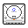
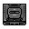
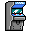
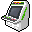
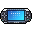

# R36S-Game-Compatibility-Lists

Hello, 
You will find in this repo several links to google sheets carrying list of games tested on ArkOS.

- Please note that some lists are not completed yet (It does take a lot of time, especially for N64) so please be patient.
- If you have any suggestions/Corrections for thoses list, please do not hesitate and create an issue on this repository.
- While being tested with a R36S device, those lists should be relevant for any device using Rockchip RK3326 SoC.

## _List of games_

  <table>
    <tr>
      <td valign="middle">
        
      </td>
      <td valign="middle">
        <a href="https://docs.google.com/spreadsheets/d/1O9oKTbVJZ5WzmIvAX5OqD6yyS54OsfNq5e9Z1nHpbx0/edit?usp=sharing" target="_blank">Sega Dreamcast</a>
      </td>
      <td valign="middle">
        Retrorun32 + Flycast_xtreme
      </td>
      <td valign="middle" align="right">
        100% completed
      </td>
    </tr>
    <tr>
      <td valign="middle">
        
      </td>
      <td valign="middle">
        <a href="https://docs.google.com/spreadsheets/d/1cRLVU2-S1te0AmryrtiElMfnKLWFWM6_Pcpnd-Aj0gw/edit?usp=sharing">Sega Saturn</a>
      </td>
      <td valign="middle">
        Standalone-bios
      </td>
      <td valign="middle" align="right">
        100% completed 
      </td>
    </tr>
    <tr>
      <td valign="middle">
        
      </td>
      <td valign="middle">
        <a href="https://docs.google.com/spreadsheets/d/1swkS6b7FK7UlZjSCL9fL8er9Uja6C0It9wE2yryrXUo/edit?usp=sharing">Sega Naomi</a>
      </td>
      <td valign="middle">
        Retrorun32 + Flycast_xtreme
      </td>
      <td valign="middle" align="right">
        0% completed
      </td>
    </tr>
    <tr>
      <td valign="middle">
        
      </td>
      <td valign="middle">
        <a href="https://docs.google.com/spreadsheets/d/1j5TMrCGLF12GamZY_Ui3W0Y8v_qLUoqugXY3ywF7CHM/edit?usp=sharing">Atomiswave</a>
      </td>
      <td valign="middle">
        Retrorun32 + Flycast_xtreme
      </td>
      <td valign="middle" align="right">
        0% completed 
      </td>
    </tr>
    <tr>
      <td valign="middle">
        
      </td>
      <td valign="middle">
        <a href="https://docs.google.com/spreadsheets/d/1HKAoZJpFNoW4uLzxl67Z98l-kYWDKHrPEaezvDSMahQ/edit?usp=sharing">Sony PSP</a>
      </td>
      <td valign="middle">
        Standalone
      </td>
      <td valign="middle" align="right">
        100% completed 
      </td>
    </tr>
    <tr>
      <td valign="middle">
        
      </td>
      <td valign="middle">
        <a href="https://docs.google.com/spreadsheets/d/1FtYqPTjKKdDMlXJqW2gNmPX3IYOPsa4-zvHqTo4YwkQ/edit?usp=sharing">Nintendo 64</a>
      </td>
      <td valign="middle">
        All emulators/cores
      </td>
      <td valign="middle" align="right">
        66% completed 
      </td>
    </tr>
    <tr>
      <td valign="middle">
        
      </td>
      <td valign="middle">
        <a href="https://docs.google.com/spreadsheets/d/13hCAIlVFnGrzd9PvA1uvdhmWeNO9NkMAkRKpvkuXcpw/edit?usp=sharing">Nintendo DS</a>
      </td>
      <td valign="middle">
        Drastic
      </td>
      <td valign="middle" align="right">
        55% completed
      </td>
    </tr>
  </table>

## Additional infos
- Device used is a R36S with original panel (not that it should matter at all)
- Micro SD used is Samsung Evo Pro Plus 2024 (Read speed of your SD card does matter)
- Using ArkOs community image (https://github.com/AeolusUX/ArkOS-R3XS)
