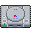

# R36S-Game-Compatibility-Lists

Hello, 
You will find in this repo several links to google sheets carrying list of games tested on ArkOS.

- Be patient! Some lists are not completed yet (It does take a lot of time, especially for N64)
- If you have any questions/suggestions/corrections for thoses list, **please do not hesitate and create an issue on this repository**.
- Please make sure to **read every sheets in the documents**, I always add an Informations sheet with useful notes, control mapping, etc..
- While being tested with a R36S device, the lists **should be relevant for any device using Rockchip RK3326 SoC**.
- You might think PlayStation list is useless but I actually saw that Crash Bandicoot had some slowdowns on an emulator and another game worked better with this same emulator (this list is not a priority at all, I may even abandon it to be honest, we'll see once I'm done with all the other lists)
- Same thing with Portmaster, I tried the Super Mario 64 and it actually didn't worked for me, so I'd like to test some ports (especialy the one that are N64/PSX/Dreamcast ports)

## _List of games_

  <table>
    <tr>
      <th></th>
      <th>Console</th>
      <th>Emulator/Core</th>
      <th>Games tested</th>
    </tr>
    <tr>
      <td valign="middle">
        
      </td>
      <td valign="middle">
        <a href="https://docs.google.com/spreadsheets/d/1j5TMrCGLF12GamZY_Ui3W0Y8v_qLUoqugXY3ywF7CHM/edit?usp=sharing">Atomiswave</a>
      </td>
      <td valign="middle">
        Retrorun32 + Flycast_xtreme
      </td>
      <td valign="middle" align="right">
        34/34
      </td>
    </tr>
    <tr>
      <td valign="middle">
        
      </td>
      <td valign="middle">
        <a href="https://docs.google.com/spreadsheets/d/1O9oKTbVJZ5WzmIvAX5OqD6yyS54OsfNq5e9Z1nHpbx0/edit?usp=sharing">Dreamcast</a>
      </td>
      <td valign="middle">
        Retrorun32 + Flycast_xtreme
      </td>
      <td valign="middle" align="right">
        121/121
      </td>
    </tr>
    <tr>
      <td valign="middle">
        
      </td>
      <td valign="middle">
        <a href="https://docs.google.com/spreadsheets/d/1FtYqPTjKKdDMlXJqW2gNmPX3IYOPsa4-zvHqTo4YwkQ/edit?usp=sharing">Nintendo 64</a>
      </td>
      <td valign="middle">
        All emulators/cores
      </td>
      <td valign="middle" align="right">
        193/288
      </td>
    </tr>
    <tr>
      <td valign="middle">
        
      </td>
      <td valign="middle">
        <a href="https://docs.google.com/spreadsheets/d/13hCAIlVFnGrzd9PvA1uvdhmWeNO9NkMAkRKpvkuXcpw/edit?usp=sharing">Nintendo DS</a>
      </td>
      <td valign="middle">
        Drastic
      </td>
      <td valign="middle" align="right">
        45/84
      </td>
    </tr>
    <tr>
      <td valign="middle">
        
      </td>
      <td valign="middle">
        Portmaster
      </td>
      <td valign="middle">
        Checking some ports if they do work
      </td>
      <td valign="middle" align="right">
        TBD
      </td>
    </tr>
    <tr>
      <td valign="middle">
        
      </td>
      <td valign="middle">
        <a href="https://docs.google.com/spreadsheets/d/1swkS6b7FK7UlZjSCL9fL8er9Uja6C0It9wE2yryrXUo/edit?usp=sharing">Sega Naomi</a>
      </td>
      <td valign="middle">
        Retrorun32 + Flycast_xtreme
      </td>
      <td valign="middle" align="right">
        0/100
      </td>
    </tr>
    <tr>
      <td valign="middle">
        
      </td>
      <td valign="middle">
        <a href="https://docs.google.com/spreadsheets/d/1cRLVU2-S1te0AmryrtiElMfnKLWFWM6_Pcpnd-Aj0gw/edit?usp=sharing">Sega Saturn</a>
      </td>
      <td valign="middle">
        Standalone-bios
      </td>
      <td valign="middle" align="right">
        80/80
      </td>
    </tr>
    <tr>
      <td valign="middle">
        
      </td>
      <td valign="middle">
        Sony Playstation
      </td>
      <td valign="middle">
        Best emulator/core for problematic games
      </td>
      <td valign="middle" align="right">
        TBD
      </td>
    </tr>
    <tr>
      <td valign="middle">
        
      </td>
      <td valign="middle">
        <a href="https://docs.google.com/spreadsheets/d/1HKAoZJpFNoW4uLzxl67Z98l-kYWDKHrPEaezvDSMahQ/edit?usp=sharing">Sony PSP</a>
      </td>
      <td valign="middle">
        Standalone
      </td>
      <td valign="middle" align="right">
        209/209
      </td>
    </tr>
  </table>

## Additional infos
- Device used is a R36S with original panel (not that it should matter at all)
- Micro SD used is Samsung Evo Pro Plus 2024 (Read speed of your SD card does matter)
- Using ArkOs community image (https://github.com/AeolusUX/ArkOS-R3XS)
- Most of the roms tested are PAL/Europe (when available, otherwise it's NTSC/US or Japanese)
